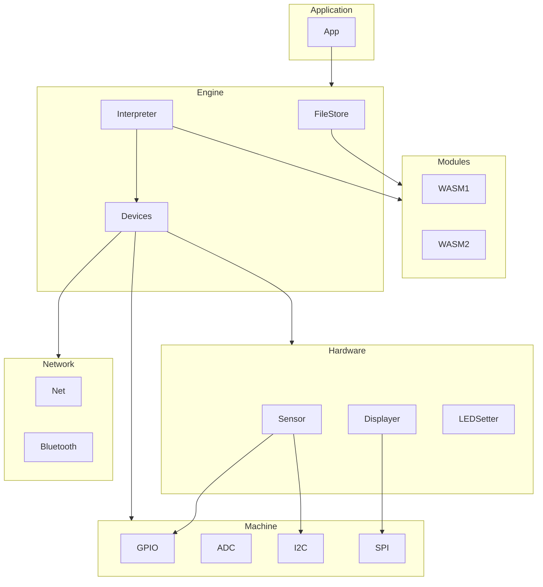

# Architecture

## Application

The host application that the developer who uses Mechanoid is creating.

## Modules

The WASM modules that developers who are creating code for this Application are writing.

## Engine

The capabilities that the Application uses/exposes for Modules.

## Devices

Wrappers around specific devices such as displays or sensors that can be used by the Application and/or Modules.

## Network

Wrappers around specific networking capabilities such as WiFi or Bluetooth that can be used by the Application and/or Modules.

## Machine

Wrappers around low-level hardware interfaces such as GPIO or I2C that can be used by the Application and/or Modules.
