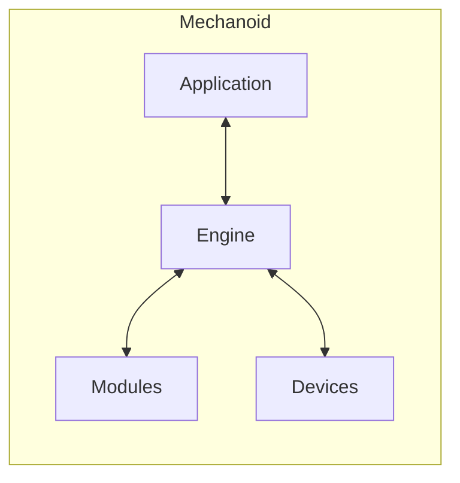
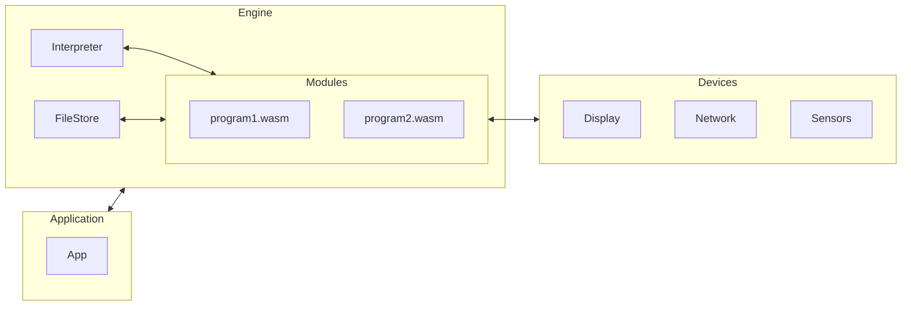

# Architecture

## Overview

### Application

The host application that the developer who uses Mechanoid is creating.

### Modules

The WASM modules that developers who are creating code for this Application are writing.

### Devices

Specific hardware devices such as displays or sensors that can be used by the Application and/or Modules. This can also include connections to networking devices such as WiFi or Bluetooth, and low-level hardware interfaces such as GPIO or I2C.

## Mechanoid Engine

### Interpreter

The Interpreter is an interface to whichever WebAssembly interpreter is to be used for this application. The default interpreter for Mechanoid is [Wazero](https://github.com/tetratelabs/wazero).

### FileStore

The FileStore is an interface to where the modules for this application can be stored, so that they can be dynamically loaded. Currently supports flash memory using the [LittleFS](https://github.com/littlefs-project/littlefs) file system.

