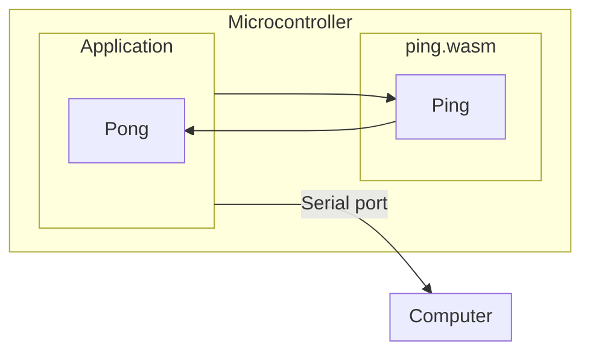

Mechanoid is a framework for developing applications using WebAssembly on embedded microcontrollers written using TinyGo.

## What is Mechanoid?

Mechanoid is an open source framework for building and running applications on small embedded microcontrollers using WebAssembly. It is intended to make it easier to create applications that run on embedded devices that are secure and extendable, and takes advantage of all of the latest developments in both WebAssembly and embedded systems development.

Mechanoid includes a command line interface tool that helps you create, test, and run applications on either simulators or actual hardware, in part thanks to being written using [TinyGo](https://tinygo.org/).

## Getting started

- Install the [Mechanoid command line tool](./cmd/mecha/README.md)

    ```
    go install github.com/hybridgroup/mechanoid/cmd/mecha@latest
    ```

- Create a new project

    ```
    mecha new example.com/myproject
    ```

- Make something amazing!

## Example

Here is an example of an application built using Mechanoid.

It consists of a host application that runs on a microcontroller, and a separate WebAssembly module that will be run by the host application on that same microcontroller.

The host application loads the WASM and then executes it, sending the output to the serial interface on the board. This way we can see the output on your computer.



### WebAssembly guest program

This is the Go code for the `ping.wasm` module. It exports a `ping` function, that calls a function `pong` that has been imported from the host application.

```go
//go:build tinygo

package main

//go:wasmimport hosted pong
func pong()

//go:export ping
func ping() {
	pong()
}

func main() {}
```

Compile this program to WASM using TinyGo:

```
$ tinygo build -size short -o ping.wasm -target ./modules/ping/ping.json -no-debug ./modules/ping
   code    data     bss |   flash     ram
      9       0       0 |       9       0
```

### Mechanoid host application

This is the Go code for the Mechanoid host application that runs on the hardware. It loads the `ping.wasm` WebAssembly module and then runs it by calling the exported `Ping()` function:

```go
package main

import (
	_ "embed"
	"time"

	"github.com/hybridgroup/mechanoid/engine"
	"github.com/hybridgroup/mechanoid/interp/wasman"
)

//go:embed ping.wasm
var pingModule []byte

func main() {
	println("Mechanoid engine starting...")
	eng := engine.NewEngine()

	println("Using interpreter...")
	eng.UseInterpreter(&wasman.Interpreter{})

	println("Initializing engine...")
	eng.Init()

	println("Defining func...")
	if err := eng.Interpreter.DefineFunc("hosted", "pong", pongFunc); err != nil {
		println(err.Error())
		return
	}

	println("Loading module...")
	if err := eng.Interpreter.Load(pingModule); err != nil {
		println(err.Error())
		return
	}

	println("Running module...")
	ins, err := eng.Interpreter.Run()
	if err != nil {
		println(err.Error())
		return
	}

	for {
		println("Calling ping...")
		ins.Call("ping")

		time.Sleep(1 * time.Second)
	}
}

func pongFunc() {
	println("pong")
}
```

You can compile and flash the WASM runtime engine and the WASM program onto an Adafruit PyBadge (an ARM 32-bit microcontroller with 192k of RAM) with this command:

```
$ mecha flash -m pybadge
   code    data     bss |   flash     ram
 101012    1736   72216 |  102748   73952
Connected to /dev/ttyACM0. Press Ctrl-C to exit.
Mechanoid engine starting...
Using interpreter...
Initializing engine...
Initializing interpreter...
Initializing devices...
Defining func...
Loading module...
Running module...
building index space
initializing memory
initializing functions
initializing globals
running start func
Calling ping...
pong
Calling ping...
pong
Calling ping...
pong
Calling ping...
pong
```

There are more examples are available in our separate repo, located here:
https://github.com/hybridgroup/mechanoid-examples

## How it works

See [ARCHITECTURE.md](./ARCHITECTURE.md) for more information.

## Goals

- [X] Able to run small WASM modules designed for specific embedded runtime interfaces.
- [X] Hot loading/unloading of WASM modules.
- [X] Local storage system for WASM modules.
- [ ] Allow the engine to be used/extended for different embedded application use cases, e.g. CLI, WASM4 runtime, others.
- [ ] Configurable system to allow the bridge interface to host capabilities to be defined per application.
