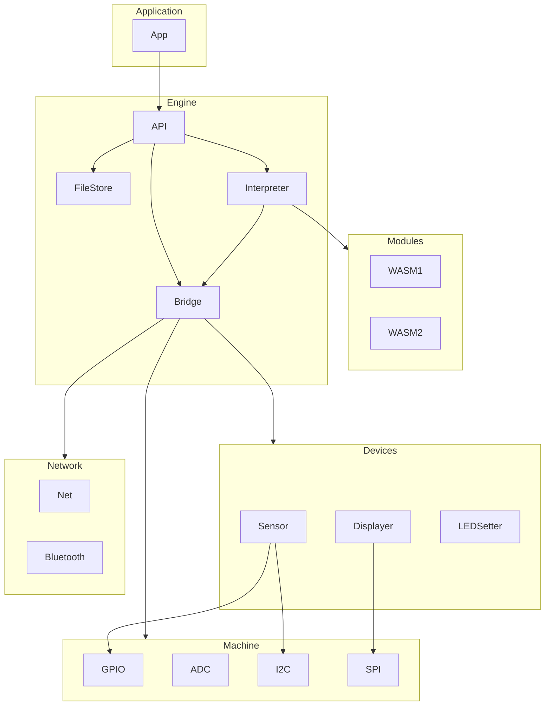

# TinyWASM

TinyWASM is a WebAssembly runtime environment for embedded microcontrollers written using TinyGo.


## How to use

### Simple

Loads an embedded WASM module and then runs it by calling the exported `Ping()` function:

```go
package main

import (
	_ "embed"
	"time"

	"github.com/hybridgroup/tinywasm/engine"
)

//go:embed ping.wasm
var binaryModule []byte

func main() {
	eng := engine.NewEngine()
	eng.Init()

	if err := eng.Interpreter.DefineFunc("hosted", "pong", pongFunc); err != nil {
		println(err.Error())
		return
	}

	mod, err := eng.Interpreter.Load(binaryModule)
	if err != nil {
		println(err.Error())
		return
	}

	if err := eng.Interpreter.Run(); err != nil {
		println(err.Error())
		return
	}

	for {
		mod.Call("ping")

		time.Sleep(1 * time.Second)
	}
}

func pongFunc() {
	println("pong")
}
```


## Architecture



#### Application

What the developer who uses TinyWASM is creating.

#### Modules

What developers who are creating code for this Application are writing.

#### Engine

The capabilities that the Application uses/exposes for Modules.

#### Devices

Wrappers around specific devices such as displays or sensors that can be used by the Application and/or Modules.

#### Network

Wrappers around specific networking capabilities such as WiFi or Bluetooth that can be used by the Application and/or Modules.

#### Machine

Wrappers around low-level hardware interfaces such as GPIO or I2C that can be used by the Application and/or Modules.

## Goals

- [ ] Able to run small WASM modules designed for some specific embedded runtime interfaces.
- [ ] Hot loading/unloading of WASM modules.
- [ ] Allow the engine to be used/extended for different embedded application use cases, e.g. CLI, WASM4 runtime, others.
- [ ] Configurable system to allow the bridge interface to host capabilities to be defined per application.
- [ ] Local storage system for WASM modules.
