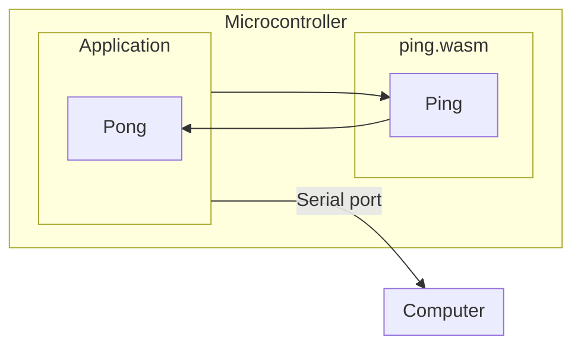

# 

Mechanoid is a framework for WebAssembly applications on embedded systems.

## What is Mechanoid?

Mechanoid is an open source framework for building and running WebAssembly applications on small embedded systems. It is intended to make it easier to create applications that are secure and extendable, and take advantage of all of the latest developments in both WebAssembly and embedded development.

Mechanoid includes a command line interface tool that helps you create, test, and run applications on either simulators or actual hardware, in part thanks to being written using [Go](https://go.dev/) and [TinyGo](https://tinygo.org/).

## Why would you want to do this?

- Devices that are extensible. Think app stores, downloadable add-ons, or end-user programmability.
- Environment is sandboxed, so bricking the device is less likely.
- Code you write being compiled to WASM is very compact.
- Devices that need a reliable way to update them.
- OTA updates via slow/high latency are more viable.
- Specific APIs can be provided by the host application to guest modules, so application-specific code matches the kind of code you are trying to write. Games, industrial control systems.
- Develop code in Go/Rust/Zig or any language that can compile to WASM, and run it on the same hardware, using the same APIs.

## Getting started

- Install the [Mechanoid command line tool](./cmd/mecha/README.md)

	Use `go install` to install the `mecha` CLI

    ```bash
    go install github.com/hybridgroup/mechanoid/cmd/mecha@latest
    ```

- Create a new project

    ```bash
    mecha new example.com/myproject
    ```

- Make something amazing!

## Example

Here is an example of an application built using Mechanoid.

It consists of a host application that runs on a microcontroller, and a separate WebAssembly module that will be run by the host application on that same microcontroller.

The host application loads the WASM and then executes it, sending the output to the serial interface on the board. This way we can see the output on your computer.



Here is how you create it using Mechanoid:

```bash
mecha new project -template=simple example.com/myproject
cd myproject
mecha new module -template=ping ping
```

### WebAssembly guest program

This is the Go code for the `ping.wasm` module. It exports a `ping` function, that calls a function `pong` that has been imported from the host application.

```go
//go:build tinygo

package main

//go:wasmimport hosted pong
func pong()

//go:export ping
func ping() {
 pong()
}

func main() {}
```

You can compile this program to WASM using the `mecha build` command:

```bash
$ mecha build
Building module ping
   code    data     bss |   flash     ram
      9       0       0 |       9       0
```

### Mechanoid host application

This is the Go code for the Mechanoid host application that runs directly on the hardware. It loads the `ping.wasm` WebAssembly module and then runs it by calling the module's `Ping()` function. That `Ping()` function will then call the host's exported `Pong()` function:

```go
package main

import (
	"bytes"
	_ "embed"
	"time"

	"github.com/hybridgroup/mechanoid/engine"
	"github.com/hybridgroup/mechanoid/interp"
	"github.com/orsinium-labs/wypes"
)

//go:embed modules/ping.wasm
var wasmCode []byte

func main() {
	time.Sleep(2 * time.Second)

	println("Mechanoid engine starting...")
	eng := engine.NewEngine()
	eng.UseInterpreter(interp.NewInterpreter())

	println("Initializing engine using interpreter", eng.Interpreter.Name())
	if err := eng.Init(); err != nil {
		println(err.Error())
		return
	}

	println("Defining host function...")
	modules := wypes.Modules{
		"hosted": wypes.Module{
			"pong": wypes.H0(pongFunc),
		},
	}
	if err := eng.Interpreter.SetModules(modules); err != nil {
		println(err.Error())
		return
	}

	println("Loading and running WASM code...")
	ins, err := eng.LoadAndRun(bytes.NewReader(wasmCode))
	if err != nil {
		println(err.Error())
		return
	}

	for {
		println("Calling ping...")
		if _, err := ins.Call("ping"); err != nil {
			println(err.Error())
		}

		time.Sleep(1 * time.Second)
	}
}

func pongFunc() wypes.Void {
	println("pong")
	return wypes.Void{}
}
```

You can compile and flash the application and the WASM program onto an Adafruit PyBadge (an ARM 32-bit microcontroller with 192k of RAM) with the `mecha flash` command:

```bash
$ mecha flash -i wazero -m pybadge
Building module ping
Done.
   code    data     bss |   flash     ram
      9       0       0 |       9       0
Application built. Now flashing...
   code    data     bss |   flash     ram
 328988   66056    7112 |  395044   73168

Connected to /dev/ttyACM0. Press Ctrl-C to exit.
Mechanoid engine starting...
Initializing engine using interpreter wazero
Defining host function...
Loading and running WASM code...
Calling ping...
pong
Calling ping...
pong
Calling ping...
pong
...
```

There are more examples available here:
<https://github.com/hybridgroup/mechanoid-examples>

## How it works

See [ARCHITECTURE.md](./ARCHITECTURE.md) for more information.

## Supported Runtime Interpreters

- [wazero](https://github.com/orsinium-forks/wazero) - requires the https://github.com/orsinium-forks/wazero fork
- [wasman](https://github.com/hybridgroup/wasman) - requires the https://github.com/hybridgroup/wasman fork

## Goals

- [X] Able to run small WASM modules designed for specific embedded runtime interfaces.
- [X] Hot loading/unloading of WASM modules.
- [X] Local storage system for WASM modules.
- [ ] Allow the engine to be used/extended for different embedded application use cases, e.g. CLI, WASM4 runtime, others. - IN PROGRESS
- [ ] Configurable system to allow the bridge interface to host capabilities to be defined per application. - IN PROGRESS
