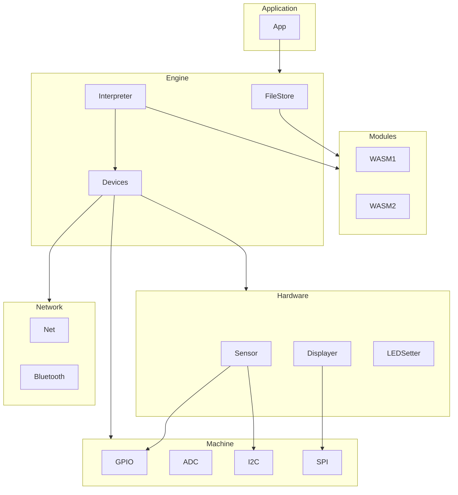

Mechanoid is a framework for developing applications using WebAssembly for embedded microcontrollers written using TinyGo.

## How to use

```
mecha new simple
...

(generates new application skeleton)

```

### Simple

Loads an embedded WASM module and then runs it by calling the exported `Ping()` function:

```go
package main

import (
	_ "embed"
	"time"

	"github.com/hybridgroup/mechanoid/engine"
	"github.com/hybridgroup/mechanoid/interp/wasman"
)

//go:embed ping.wasm
var pingModule []byte

func main() {
	println("Mechanoid engine starting...")
	eng := engine.NewEngine()

	println("Using interpreter...")
	eng.UseInterpreter(&wasman.Interpreter{})

	println("Initializing engine...")
	eng.Init()

	println("Defining func...")
	if err := eng.Interpreter.DefineFunc("hosted", "pong", pongFunc); err != nil {
		println(err.Error())
		return
	}

	println("Loading module...")
	if err := eng.Interpreter.Load(pingModule); err != nil {
		println(err.Error())
		return
	}

	println("Running module...")
	ins, err := eng.Interpreter.Run()
	if err != nil {
		println(err.Error())
		return
	}

	for {
		println("Calling ping...")
		ins.Call("ping")

		time.Sleep(1 * time.Second)
	}
}

func pongFunc() {
	println("pong")
}
```

You can compile and flash the WASM runtime engine and the WASM program onto an Adafruit PyBadge (an ARM 32-bit microcontroller with 192k of RAM) with this command:

```
$ tinygo flash -size short -target pybadge -monitor ./examples/simple
   code    data     bss |   flash     ram
 101012    1736   72216 |  102748   73952
Connected to /dev/ttyACM0. Press Ctrl-C to exit.
Mechanoid engine starting...
Using interpreter...
Initializing engine...
Initializing interpreter...
Initializing devices...
Defining func...
Loading module...
Running module...
building index space
initializing memory
initializing functions
initializing globals
running start func
Calling ping...
pong
Calling ping...
pong
Calling ping...
pong
Calling ping...
pong
```

See the `examples` for more information.

## Architecture



#### Application

The host application that the developer who uses Mechanoid is creating.

#### Modules

The WASM modules that developers who are creating code for this Application are writing.

#### Engine

The capabilities that the Application uses/exposes for Modules.

#### Devices

Wrappers around specific devices such as displays or sensors that can be used by the Application and/or Modules.

#### Network

Wrappers around specific networking capabilities such as WiFi or Bluetooth that can be used by the Application and/or Modules.

#### Machine

Wrappers around low-level hardware interfaces such as GPIO or I2C that can be used by the Application and/or Modules.

## Goals

- [X] Able to run small WASM modules designed for specific embedded runtime interfaces.
- [X] Hot loading/unloading of WASM modules.
- [X] Local storage system for WASM modules.
- [ ] Allow the engine to be used/extended for different embedded application use cases, e.g. CLI, WASM4 runtime, others.
- [ ] Configurable system to allow the bridge interface to host capabilities to be defined per application.
